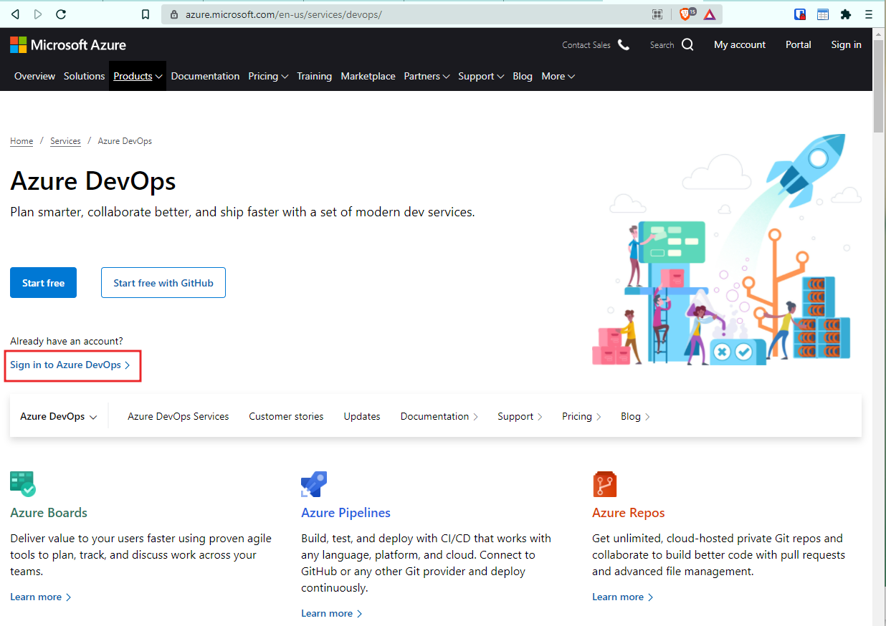
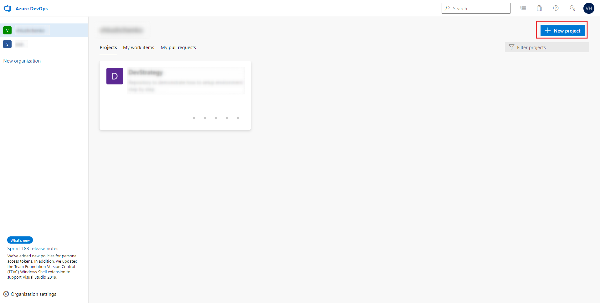
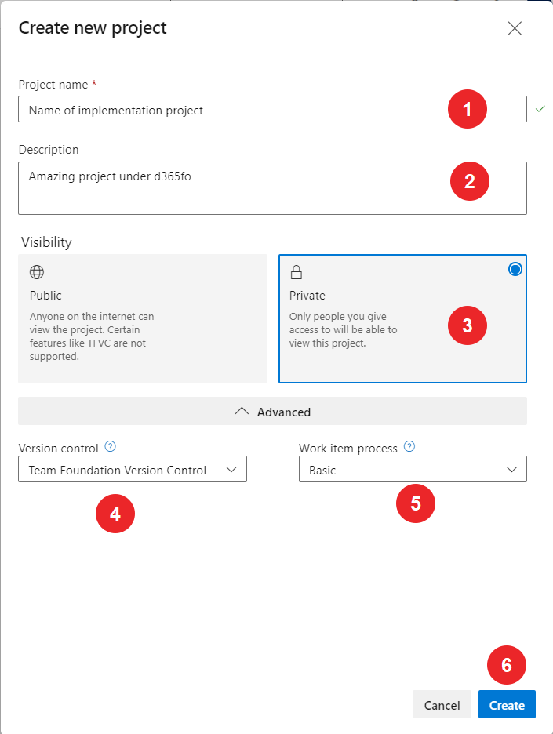
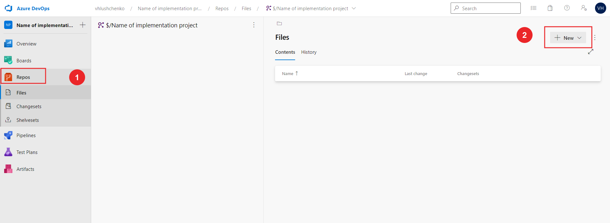
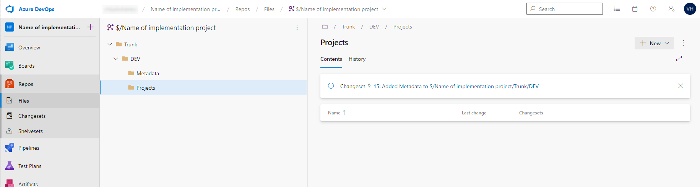

# Build, deploy on D365fo

- [Build, deploy on D365fo](#build-deploy-on-d365fo)
  - [Glossary](#glossary)
  - [Development process](#development-process)
  - [Minimal setup Azure devops](#minimal-setup-azure-devops)
    - [Folder/branch creating strategy](#folderbranch-creating-strategy)
    - 
- [LCS](#lcs)
  - [Setup development environment](#setup-development-environment)
  - [Create new model](#create-new-model)

Main goal of this documentation is describe step by step guide to make development in D365fo simple, clear and understandable. Full documentation and recomendations presented by Microsoft and different blogs. This site just only need to make clear some questions with more examples and usecases.

## Glossary

To make possible to understand each others we should dial about terms in our documentation. All terms provide information to agree requirements between team members indide project

Full list of terms you can find on this page [page](/glossary.md)

## Development process

Implementation project has several phases. Please find more detail information about ALM process in Microsoft docs site. In two words, we should understand new requirements to product, understand why standard functionality not cover this requirements, describe new functionality on FDD. Functional consultant agree with Key users business requirements, Dev team lead estimate necessary changes, FDD going to approval process. Aprroved FDD assigned to developer. Developer develop changes and assign document to Consultant testing, Consultant assign new modification to Key user test. Please find more detailed description on [Development process page](/development-process.md)

## Minimal setup Azure devops

To setup Azure DevOps need to go to [Azure DevOps](https://azure.microsoft.com/en-us/services/devops/), login to Azure DevOps

and create new project.

Select your organizations and press the "New button".

Setup basic parameters

where

| #   | Field name        | Description                                                                               |
| --- | ----------------- | ----------------------------------------------------------------------------------------- |
| 1   | Project name      | Enter project name                                                                        |
| 2   | Description       | Enter project Description                                                                 |
| 3   | Visibility        | Select project Visibility                                                                 |
| 4   | Version control   | Select Version control system VSTS or GIT. Now and later all description will around VSTS |
| 5   | Work item process | Select Work item process based on standards on company                                    |
| 6   | "Create" button   | Press "Create" button to create a new project                                             |

Also need to create a new folders `Trunk`, `Trunk\DEV`, `Trunk\DEV\Projects`, `Trunk\DEV\Metadata` under Repository section

Also we should convert `DEV` folder to branch. This and all other setup we run in DEV box.

### Folder/branch creating strategy

We can have any folders/branch name and can create it for each our needs. Microsoft only suggest to use `Main` folder/branch for environment upgrade, all others is depends of our needs. However, working from many different project better to use understandable and clear name for each folder/branch. We are recommend to use name below for different purpose

|Name|Path|Purpose of use|
|---|---|---|
|Trunk|root|Common folder for collect all actual development|
|Main|Trunk\Main|Branch for already tested and released code. It uses for collect ready to release to UAT code|
|Dev|Trunk\Dev|Branch for collect code from developers VMs|
|Dev-Feature|Trunk\Dev-Feature|Branch for collect code from developers VMs working under add new features |
|Main-Feature|Trunk\Main-Feature|Branch for collect features code ready tested and ready to release|

### 
# LCS

LCS is a Live cycle service from Microsoft. This service is a web site <https://lcs.dynamics.com/>

Main goal for this service allow to manage D365FO implementation projects and all aspects related to this project. Select or create new project and enter into it.

On gamburger menu most main options it is

- Cloud-hosted environments - list of managed environments in project
- Asset library - library with projects artifacts (database backups, update packages etc...)

Cloud-hosted environments allows to manage environments (create, destroy, start, stop, update, login etc)

Where

| #   | Description                                  |
| --- | -------------------------------------------- |
| 1   | Possibility to add new environment           |
| 2   | Possibility to destroy existing environment  |
| 3   | Edit environment                             |
| 4   | Start/stop environment                       |
| 5   | Possibility to log on to D365FO              |
| 6   | Information about Azure connection           |
| 7   | Current selected environment                 |
| 8   | Credentions to login to environment over RDP |

## Setup development environment

All development is going on DEV boxes. One dev box designed for one developer. DEV box is a virtual machine. It can be placed on cloud and on premice as well. We will describe on cloud version only. DEV box it is already ready to work VM - All in one VM. It contain Visual studio installed, Dynamics 365 for finance and operations, MS Sql server, MS Office etc.

[How to deploy DEV box](/deploy-new-dev-box.md)

Login to DEV box

Where

| #   | Description                                         |
| --- | --------------------------------------------------- |
| 1   | Link do downloadable file with RDP setup connection |
| 2   | User for login to DEV Box                           |
| 3   | Password for user to DEV Box                        |

In DEV Box we should run Visual studio (current supported version 2017) as Administrator

Enter credentials to Visual studio to continue work

When we open first time Visual studio we should setup our Azure DevOps repository. VS/menu/View/Team explorer.

Select existing connection or add new connection

Select Advanced

And setup map between DEV box local resources and repository

Agree with confirmation

For current moment we have setup VS code with our repository. If repository already has objects - its will synchronize when you press `Yes` button.

## Create new model