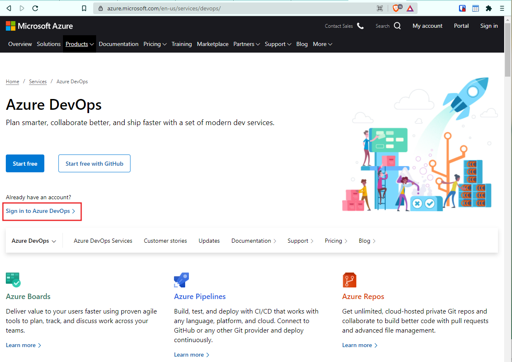
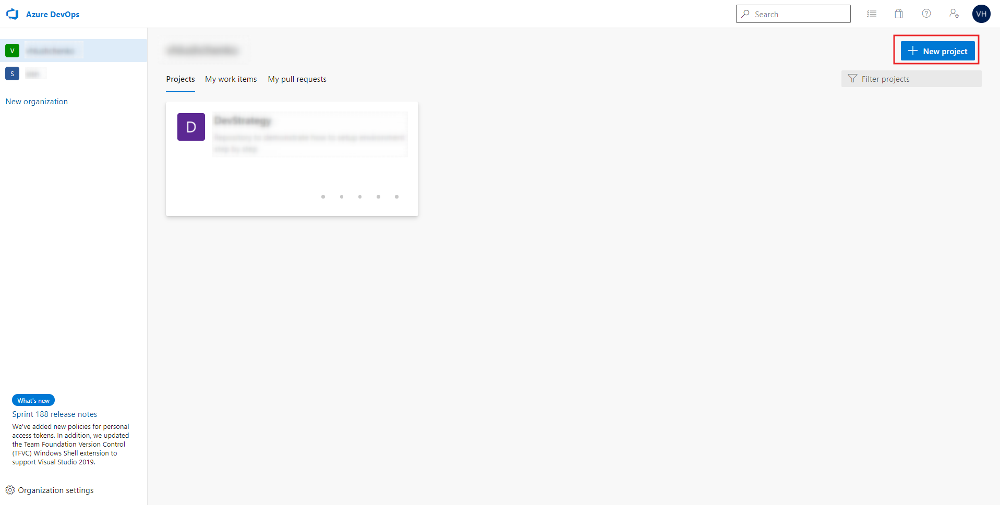
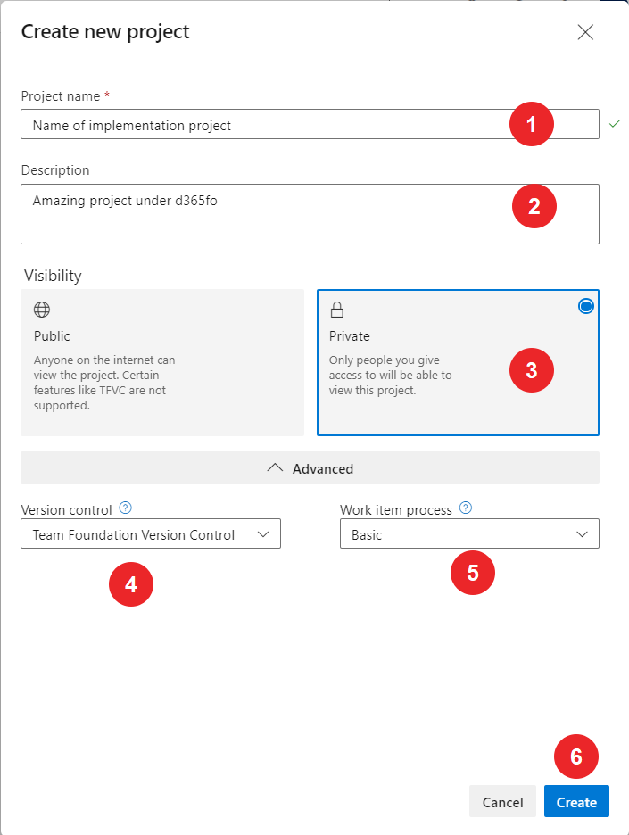
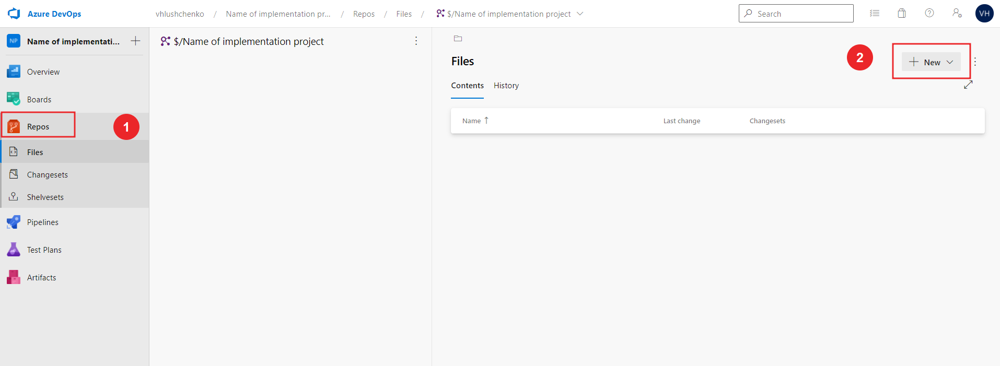

# Build, deploy on D365fo

Main goal of this documentation is describe step by step guide to make development in D365fo simple, clear and understandable. Full documentation and recomendations presented by Microsoft and different blogs. This site just only need to make some questions with more examples and usecases.

## Glossary

To make possible to understand each others we should dial about terms in our documentation. All terms provide information to agree requirements between team members indide project

Full list of terms you can find on this page [page](/glossary.md)

## Development process

Implementation project has several phases. Please find more detail information about ALM process in Microsoft docs site. In two words, we should understand new requirements to product, understand why standard functionality not cover this requirements, describe new functionality on FDD. Functional consultant agree with Key users business requirements, Dev team lead estimate necessary changes, FDD going to approval process. Aprroved FDD assigned to developer. Developer develop changes and assign document to Consultant testing, Consultant assign new modification to Key user test. Please find more detailed description on [Development process page](/development-process.md)

## Minimal setup Azure devops

To setup Azure DevOps need to go to [Azure DevOps](<[entity:value](https://azure.microsoft.com/en-us/services/devops/)>), login to Azure DevOps

and create new project.

Select your organizations and press the "New button".

Setup basic parameters

where

| #   | Field name        | Description                                                                               |
| --- | ----------------- | ----------------------------------------------------------------------------------------- |
| 1   | Project name      | Enter project name                                                                        |
| 2   | Description       | Enter project Description                                                                 |
| 3   | Visibility        | Select project Visibility                                                                 |
| 4   | Version control   | Select Version control system VSTS or GIT. Now and later all description will around VSTS |
| 5   | Work item process | Select Work item process based on standards on company                                    |
| 6   | "Create" button   | Press "Create" button to create a new project                                             |

Also need to create a new folders under Repository section

As final 

## Setup development environment

All development is going on DEV boxes. One dev box for one developer. DEV box this is Tier 1
